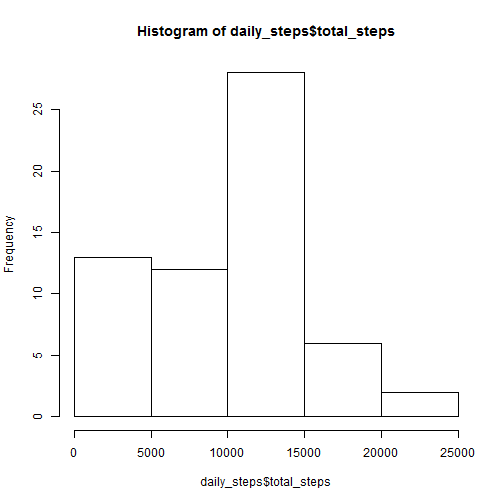
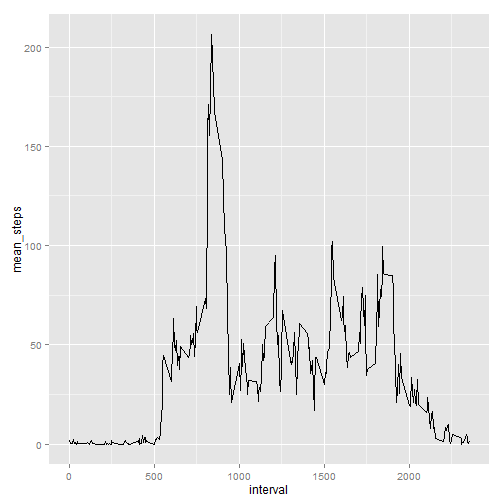
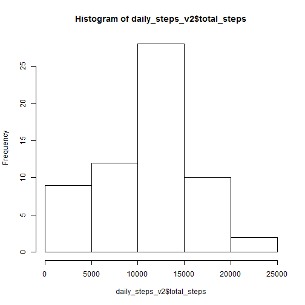
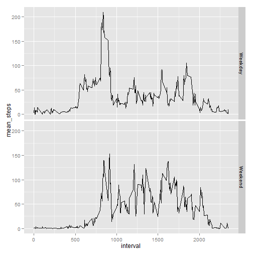
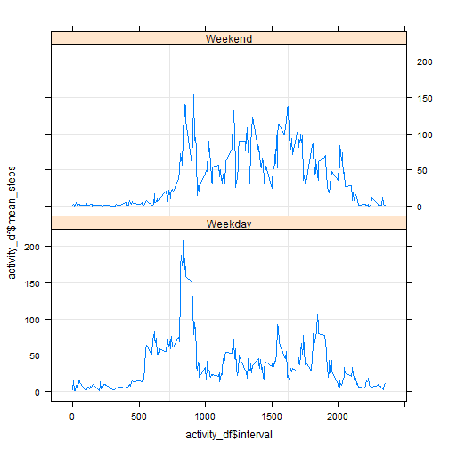

## Loading and preprocessing the data

```r
activity <- read.csv("activity.csv", header = TRUE)##, na.string = "NA")
activity$date <- as.Date(activity$date, "%Y-%m-%d")
activity$weekday <- weekdays(as.Date(activity$date))
activity <- transform(activity, date = factor(date))
```
## What is mean total number of steps taken per day?

```r
daily_steps <- aggregate(activity$steps, by = list(activity$date), FUN = sum, na.rm = TRUE)
colnames(daily_steps) <- c("date", "total_steps")
### Histogram (2)
hist(daily_steps$total_steps)  
```

 

```r
### Mean      (3a)
mean(daily_steps$total_steps)   
```

```
## [1] 9354.23
```

```r
### Median    (3b)
median(daily_steps$total_steps) 
```

```
## [1] 10395
```
## What is the average daily activity pattern?

```r
library(ggplot2)
mean_interval_steps <- aggregate(activity$steps, by = list(activity$interval), FUN = mean, na.rm = TRUE)
colnames(mean_interval_steps) <- c("interval", "mean_steps")
# Line Chart (1)
qplot(x = interval, y = mean_steps, data = mean_interval_steps
      , geom="line", stat = "identity")               
```

 

```r
max_mean_steps <- max(mean_interval_steps$mean_steps)
# Interval with Max Mean Steps (2)
subset(mean_interval_steps, mean_steps == max_mean_steps)
```

```
##     interval mean_steps
## 104      835   206.1698
```
## Imputing missing values
### Count of NAs

```r
sum(is.na(activity$steps)) # 2,304
```

```
## [1] 2304
```
### Impute missing values with mean for weekday & interval

```r
mean_steps <- aggregate(activity$steps
  , by = list(activity$weekday, activity$interval)
  , FUN = mean, na.rm = TRUE)   
colnames(mean_steps) <- c("weekday", "interval", "mean_steps")
activity_w_mean <- merge(activity, mean_steps, by = c("weekday", "interval"))
  #sum(is.na(activity_w_mean$steps)) 
activity_w_mean$steps[is.na(activity_w_mean$steps)] <- activity_w_mean$mean_steps
```

```
## Warning in activity_w_mean$steps[is.na(activity_w_mean$steps)] <-
## activity_w_mean$mean_steps: number of items to replace is not a multiple
## of replacement length
```

```r
  #sum(is.na(activity_w_mean$steps)) 
actv2_colnames <- c("steps", "date", "interval", "weekday")
activity_v2 <- activity_w_mean[,actv2_colnames]
daily_steps_v2 <- aggregate(activity_v2$steps, by = list(activity_v2$date), FUN = sum, na.rm = TRUE)
colnames(daily_steps_v2) <- c("date", "total_steps")
```
### Histogram

```r
hist(daily_steps_v2$total_steps)  
```

 
### Mean

```r
mean(daily_steps_v2$total_steps)   ## 10,654.04
```

```
## [1] 10654.04
```
### Median 

```r
median(daily_steps_v2$total_steps)
```

```
## [1] 10765
```
## Are there differences in activity patterns between weekdays and weekends?
### Create a factor variable with 2 levels

```r
activity_v2$DayOrEnd <- factor(
                        ifelse(
                            activity_v2$weekday %in% c("Monday", "Tuesday", "Wednesday", "Thursday", "Friday"), "Weekday", "Weekend")
                            )
```
### Panel plot 1

```r
library(plyr)
activity_df <- ddply(activity_v2, .(DayOrEnd, interval), summarize, mean_steps = mean(steps))
qplot(x = interval, y = mean_steps, data = activity_df
       , facets = DayOrEnd~., geom="line", stat = "identity")  
```

 
### Panel plot 2

```r
library(lattice)
xyplot(activity_df$mean_steps ~ activity_df$interval | activity_df$DayOrEnd,
       data = activity_df, 
       layout = c(1,2),
       panel = function(x, y) {
         panel.grid(h = -1, v = 2)
         panel.xyplot(x, y, type = "l")
       })
```

 
